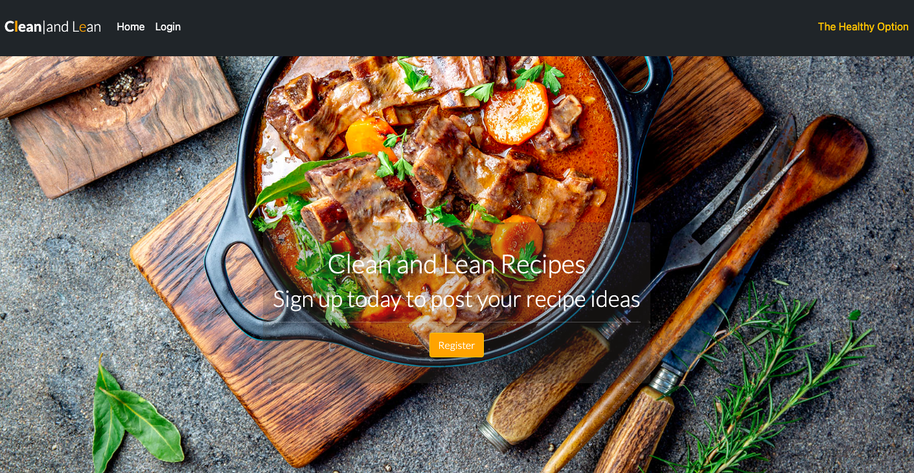
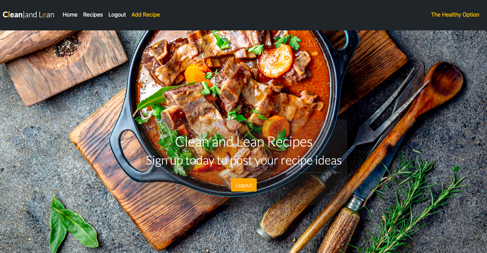

# Clean and Lean Blog

This is a full-stack project employing the programming and framework tools Django, Bootstrap, Python, HTML and CSS. The primary goals of the project were to provide a fully functioning and responsive website allowing users the ability to post up recipes, comment on recipes and also provide the option for users to like or unlike recipes.
  

## Site Overview

The Clean and Lean Blog is a site created with the intention of providing information on exciting recipes and also offering the user an opportunity to post up their own recipe ideas that they would like to share with other enthusiasts. The resource is created for those who enjoy cooking. It is designed to give a user a degree of knowledge and inspiration when it comes to all things culinary.
  

It is a website designed to be interacted with by people of all ages who have a keen interest in food and its use serves to provide a fun and interesting experience for those passionate about this artform.
  

The Home page of the blog is the primary source that reflects a strong and appealing visual of what the website is all about. The opening title highlights a relationship to the content and allows a user to create an account to allow them access to post up their own recipes. The Home page also gives a user the option to sign in should they be a previously registered user on the site.
  

 

# Planning Stage
 

## Identifying a Target Audience
 

* People who enjoy cooking.

* People who are interested in posting up their recipes, engaging with other users and those who are interested in imparting their own food wisdom on the website.

* People who have a keen interest in the culinary process and finding out a little bit more about how other food enthusiasts put their recipes together.

  

# User Stories
 

## First-time Visitors

* Users should want to have immediate information on the subject matter of the website.

* The site should have the ability to be easily navigable for visitors to get started in viewing and posting up recipes.

* The site should provide inspiration for a visitor who is interested in all things related to food.

 

## Returning Visitors

* For returning visitors it would be good to have more recipes available for those users to try out.

 

## Admin

* As a site administrator it is possible to create, edit, and delete recipes and comments on the blog.
* As a site administrator it is possible to moderate what comments are allowed on the website.

 

## User

* As a user it is possible to create an account, log in and out of that account.
* As a user it is possible to post up recipes after registering an account.
* As a user it is possible to comment on posted recipes.
* As a user it is possible to like or unlike recipes.

 

# Design

 

## Colour Schemes

 

* For the colour schema of the website I wanted to introduce a rich and rustic surround to the site. The landing page image was indicative of how I perceived the whole project concept, warm and inviting, to tie in accurately with the recipes offered in the site. 

* As the website landing page image is a notable feature on first viewing it didn't need too much of a remove when deciding appropriate colours to co-incide with the visual of the website. Button colours and the Brand lettering worked well with rgb(255, 165, 0). For the card recipes this was offset subtly with rgb(251, 241, 222), giving not much in the way of a large remove on subsequent pages.

* Hover options on buttons employed slight contrasts to original button colours.

 

## Font Families

 

* Font Families included Lato, Roboto and Sans Serif. It added a clarity and refinedness that the pages deserved. 

  

# Features

 

## The Home and Registration Page

 

  * The Home Page consists of the Clean and Lean brand name logo 

  * An opacity element was integrated into the inner box feature allowing more transparency to view the background.

   

   

   

  ## The Login Page

   

  * The Home Page consists of the primary details and information on how to register to post up receipes.

  * 

   

  

   

  ## The Recipes Page

   

  * The Questions Page is where a bank of 8 questions on music are compiled and rendered.

  * Interactive parts come in the form of radio buttons where an answer can be selected, and again, through Back and Submit buttons, allowing a user to return back to the Information or Start page or submit an answer to the quiz.

   

  

    

  # Testing

  * The project was tested rigorously in a responsive manner, particularly for rendering on smaller and mobile devices. Devices used were: Mobile (Xiaomi Mi 10, 6"), Tablet (Samsung, 7.5" & iPad Air, 8"), Laptop (MacBook Air, 13"). 

  * The site was tested on different browsers, Chrome, Safari and Firefox.

   

  # Responsiveness

  

   

  * The responsiveness of the site was ran through [Responsive Design Checker](https://responsivedesignchecker.com/) and rendered well on all mobile devices during testing.

   

  # Validation

  * No errors were recorded when entered into the official W3C Validator for HTML.

   

  

  * No errors were recorded when entered into the official W3C Validator for CSS.

   

  

  * No errors were recorded when entered into JSHint.

   

  

    

  # Web Developer Tools
  
   
  
  ## Lighthouse

   

   

    

  # Future Features

  * Create the option for individual users to edit or delete their recipes.

  * Include a feature that.

  * 

    

  # Bugs

   

  * I encountered a few issues where the site didn't meet my intended expectations. This primarily resided in the arena of responsiveness when viewing the screen at mobile level. The Summernote default widget form was difficult to  didn't render seamlessly in a landscape view. A fix for this was to dispense with static height and width properties that were yielding limitations when added to the body.

  * 

  * 

    

  # Unfixed Bugs

   

  * There were no unfixed bugs.

    

  # Deployment

   

  * The website was deployed to GitHub Pages in the following manner:

    * From the project's [Repository](https://github.com/Th3ThirdMan/music-quiz) go to Settings:
    * Scroll down to GitHub Pages
    * Select Branch, Main & Save.
    * A message will indicate that the project has been successfully deployed here and a live link is available.

     

    You can find the live site here: [Music Quiz](https://th3thirdman.github.io/music-quiz/)

      

    ## Content & Media

     

    The content and media used during the project was sourced and referenced as follows:

     

     * Knowledge Base [W3Schools](https://www.w3schools.com/)
     * Responsive Aid [AmIResponsive](http://ami.responsivedesign.is/)
     * Social Media Icons [Font Awesome](https://fontawesome.com/)
     * Fonts [Google Fonts](https://fonts.google.com/

